<div align="center">


# 🩸 BlueVein

### *Forget about re-pairing Bluetooth devices*
**Dual-boot without the headache**

<br>

[](https://github.com/meowrch/BlueVein/issues)
[](https://github.com/meowrch/BlueVein/stargazers)
[](./LICENSE)


[](./README.ru.md)
[](./README.md)

[🚀 Quick Start](#quick-start) -  [⚡ How It Works](#how-it-works) - [🔬 Technical Details](#technical-details) - [💬 Support](#support)

</div>

***

## 🎯 The Problem We Solved

### **Sound familiar?**

<table> 
  <tr> 
  <td>
  
🎧 **You're in Windows** 

Connected Bluetooth headphones → Works perfectly!

</td> 
  </tr> 
  <tr> 
  <td>

🔄 **Reboot to Linux**

Headphones don't work → Need to **pair again**

</td> 
  </tr>
  <tr> 
  <td>

🔁 **Back to Windows**

Headphones don't work again → **Pair again**

</td> 
  </tr>
</table>

> [!CAUTION]
> **This hell repeats EVERY time** you switch between OSes. \
> With headphones. With mouse. With keyboard. With gamepad. With all devices.

> [!NOTE]
> Interesting fact. You typically spend 1 to 3 minutes reconfiguring bluetooth devices when switching between OSes. \
> **3 minutes × 3 switches per day × 250 working days = 37.5 hours per year.**


### **BlueVein is the solution:**

Pair your device **once** in any OS. \
Switch between Windows and Linux. \
**Everything works automatically**. Forever.

## 🌟 Why BlueVein?

<div align="center">

| Feature | What it gives you |
|:---:|:---|
| 🔄 **Bidirectional sync** | Changes in any OS are instantly synchronized |
| 🚀 **Zero configuration** | Install → Run → Forget about the problem |
| 💾 **Direct EFI access** | No partition mounting via [fat32-raw](https://github.com/meowrch/fat32-raw) |
| 🛡️ **Security** | Works at system level with administrator privileges |
| 📡 **Real-time monitoring** | Tracks changes instantly |
| 🔍 **Periodic checking** | Checks for updates from the other OS every 30 seconds |

</div>

## <a name="quick-start"></a>🚀 Quick Start

### Linux

#### Option 1: Arch Linux (AUR)

```bash
# Install via AUR
yay -S bluevein-bin

# Start the service
sudo systemctl enable --now bluevein

# Check status
sudo systemctl status bluevein
```

#### Option 2: Manual build (any distribution)

```bash
# 1. Clone and build
git clone https://github.com/meowrch/BlueVein.git
cd BlueVein
cargo build --release

# 2. Install
sudo cp target/release/bluevein /usr/bin/
sudo cp ./systemd/bluevein.service /etc/systemd/system/

# 3. Run
sudo systemctl daemon-reload
sudo systemctl enable --now bluevein

# 4. Verify
sudo systemctl status bluevein
```

### Windows

#### Option 1: Pre-built release

1. Go to [Releases](https://github.com/meowrch/BlueVein/releases)
2. Download `bluevein.exe` from the latest release
3. Open PowerShell as Administrator
4. Execute:

```bash
# Install and start
.\bluevein.exe install
.\bluevein.exe start

# Verify
Get-Service BlueVeinService
```

#### Option 2: Manual build

```bash
# 1. Build
cargo build --release
cd target\release

# 2. Open PowerShell as Administrator

# 3. Install and start
.\bluevein.exe install
.\bluevein.exe start

# 4. Verify
Get-Service BlueVeinService
```

## ⌨️ Service Management

### Linux

```bash
# Start/stop/restart
sudo systemctl start bluevein
sudo systemctl stop bluevein
sudo systemctl restart bluevein

# Status and logs
sudo systemctl status bluevein
sudo journalctl -u bluevein -f

# Autostart
sudo systemctl enable bluevein   # enable
sudo systemctl disable bluevein  # disable
```

### Windows

```powershell
# Service management
.\bluevein.exe start      # Start
.\bluevein.exe stop       # Stop
.\bluevein.exe install    # Install
.\bluevein.exe uninstall  # Uninstall

# Or via net
net start BlueVeinService
net stop BlueVeinService

# Check status
Get-Service BlueVeinService
```

## <a name="how-it-works"></a>🔥 How It Works?

### System Architecture


### Synchronization Algorithm

```mermaid
sequenceDiagram
participant OS as Operating System
participant Monitor as BlueVein Monitor
participant EFI as EFI/bluevein.json

Note over OS,EFI: 1️⃣ System boot
Monitor->>EFI: Reads keys from EFI
Monitor->>OS: Reads local devices
Monitor->>OS: Updates device keys from EFI if they differ
Monitor->>EFI: Adds new devices from OS to EFI

Note over OS,EFI: 2️⃣ New device pairing
OS->>Monitor: Event: new device
Monitor->>EFI: Reads current bluevein.json
Monitor->>EFI: Adds/updates device key

Note over OS,EFI: 3️⃣ Periodic check (every 30 sec)
Monitor->>EFI: Checks for changes from other OS
Monitor->>OS: Applies new keys to existing devices
```



### Key Operating Principles

- **On boot:** BlueVein checks keys in EFI and updates them for devices present in the system. New devices from the system are added to EFI
- **On new pairing:** The key is immediately saved to EFI and becomes available to the other OS
- **On removal:** The device remains in EFI (it may be active on the other OS)
- **Periodically:** Checks for changes every 30 seconds and applies key updates from EFI

## <a name="technical-details"></a>🔬 Technical Details

### Bluetooth LE Support

BlueVein fully supports Bluetooth Low Energy devices with all key types:

| Key Type | Purpose | Support |
|----------|---------|-------|
| **LTK** | Long Term Key — main encryption key | ✅ Full |
| **Peripheral LTK** | LTK for device in peripheral role | ✅ Full |
| **IRK** | Identity Resolving Key — for privacy (random MAC) | ✅ Full |
| **CSRK** | Connection Signature Resolving Key — for data signing | ✅ Full |
| **AddressType** | Address type (public/random) | ✅ Full |

### Architecture Decisions

**Dual-mode devices:**
BlueVein automatically merges Classic and LE keys for devices supporting both modes (e.g., many Bluetooth headphones).

**CSRK SignCounter:**
- Windows doesn't persist SignCounter in registry — it's kept in driver memory only
- BlueVein stores Counter in `bluevein.json` and takes MAX value during sync
- This prevents counter rollback and protects against replay attacks

### Known Limitations

**CSRK SignCounter on Windows:**
Windows Bluetooth stack doesn't persist SignCounter in registry. BlueVein works around this by storing it in `bluevein.json`, but frequent OS switching may reduce accuracy.

**Impact:** Minimal. Modern LE devices (keyboards, mice, headphones, gamepads) use LTK for encrypted connections, not CSRK for data signing. Issue may only affect specific IoT devices using unencrypted connections with signing.

**Solution:** If device doesn't auto-connect after sync — re-pair once. Counter will reset and everything will work.

## 📚 FAQ

### Will this break my Bluetooth?
No. BlueVein only reads and writes pairing keys. It doesn't touch drivers or system files.

### What devices are supported?
**Any Bluetooth devices**: headphones (AirPods, Sony, Bose), mice (Logitech MX Master), keyboards, gamepads (Xbox, PS5).

**Tested on:**
- AirPods Pro 2
- Sony WH-1000XM5
- Logitech MX Master 3
- Xbox Series X Controller

### Is my data safe?
Yes. Pairing keys are stored in the EFI partition, which only root/admin can access. BlueVein runs with elevated privileges, but the [code is open](https://github.com/meowrch/BlueVein) — you can verify it yourself.

### What about BitLocker or LUKS encryption?
BlueVein works independently of disk encryption. The EFI partition is typically not encrypted and accessible before OS boot.

### Does it work with triple-boot?
Yes. BlueVein synchronizes keys between **all** OSes on one machine, regardless of how many there are.

### What if I already have `bt-dualboot` installed?
BlueVein is **fully automatic** and works in real-time as a background service.

`bt-dualboot`, besides requiring manual commands after each pairing, has several other drawbacks identified by the community:
- **Crashes on real devices.** Doesn't support LE keyboards. Crashes on some configurations.
- **Doesn't work with multiple Bluetooth adapters.** If you have built-in + external adapter — you'll get an error.
- **Requires** mounting the Windows partition.
- **Uses [hacky methods](https://www.kali.org/tools/chntpw/)** to modify Windows system registry
- **Abandoned since 2022** — issues remain unanswered

---

## ⚒️ Troubleshooting

| Problem | Solution |
|---------|----------|
| ❌ **Service won't start (Linux)** | Run `sudo systemctl status bluevein` and check logs: `sudo journalctl -u bluevein -n 50` |
| ❌ **Service won't start (Windows)** | Make sure PowerShell is running **as Administrator** |
| ❌ **Device still won't sync** | Check that EFI partition is mounted: `lsblk -f \| grep vfat` (Linux) or verify the service is running |
| ❌ **Permission denied** | BlueVein requires root/admin. On Linux use `sudo systemctl` or run the service as root |

> [!TIP]
> **Still not working?** \
> [Open an issue](https://github.com/meowrch/BlueVein/issues) with logs and OS information.

## <a name="support"></a>💬 Support

### 🐛 Found a bug?

1. Collect logs:
   ```bash
   # Linux
   sudo journalctl -u bluevein -n 100 > bluevein_logs.txt
   
   # Windows
   C:/ProgramData/BlueVein/bluevein.log
   ```

2. [Create an Issue](https://github.com/meowrch/BlueVein/issues) with detailed description and logs

### 💡 Have an idea?

Open a [Feature Request](https://github.com/meowrch/BlueVein/issues/new) — we always welcome improvements!

## 🤝 Contributing

Want to improve BlueVein? We'd love your contribution!

1. Fork the repository
2. Create a feature branch (`git checkout -b feature/AmazingFeature`)
3. Commit your changes (`git commit -m 'Add some AmazingFeature'`)
4. Push to the branch (`git push origin feature/AmazingFeature`)
5. Open a Pull Request

## ☕ Support the Project

<div align="center">

**Like BlueVein?** Help the project grow! 🚀

| 💎 Cryptocurrency | 📬 Address |
|:---:|:---|
| **TON** | `UQB9qNTcAazAbFoeobeDPMML9MG73DUCAFTpVanQnLk3BHg3` |
| **Ethereum** | `0x56e8bf8Ec07b6F2d6aEdA7Bd8814DB5A72164b13` |
| **Bitcoin** | `bc1qt5urnw7esunf0v7e9az0jhatxrdd0smem98gdn` |
| **Tron** | `TBTZ5RRMfGQQ8Vpf8i5N8DZhNxSum2rzAs` |

<br>

*Every donation motivates us to continue developing the project! ❤️*

</div>

## 📊 Project Statistics

<a href="https://star-history.com/#meowrch/BlueVein&Date">
<picture>
<source media="(prefers-color-scheme: dark)" srcset="https://api.star-history.com/svg?repos=meowrch/BlueVein&type=Date&theme=dark" />
<source media="(prefers-color-scheme: light)" srcset="https://api.star-history.com/svg?repos=meowrch/BlueVein&type=Date" />

</picture>
</a>

---

<div align="center">

**Made with ❤️ for the Linux community**

</div>