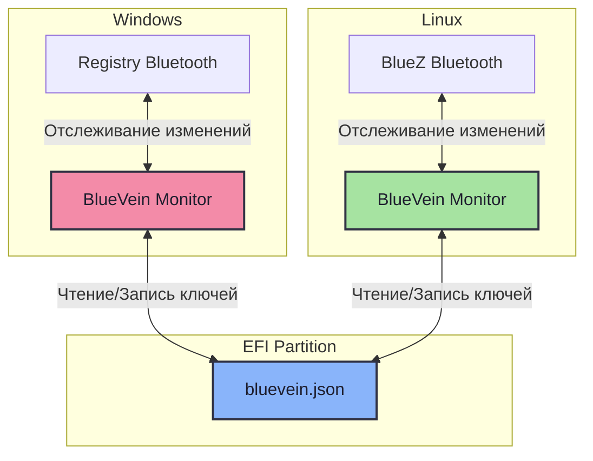
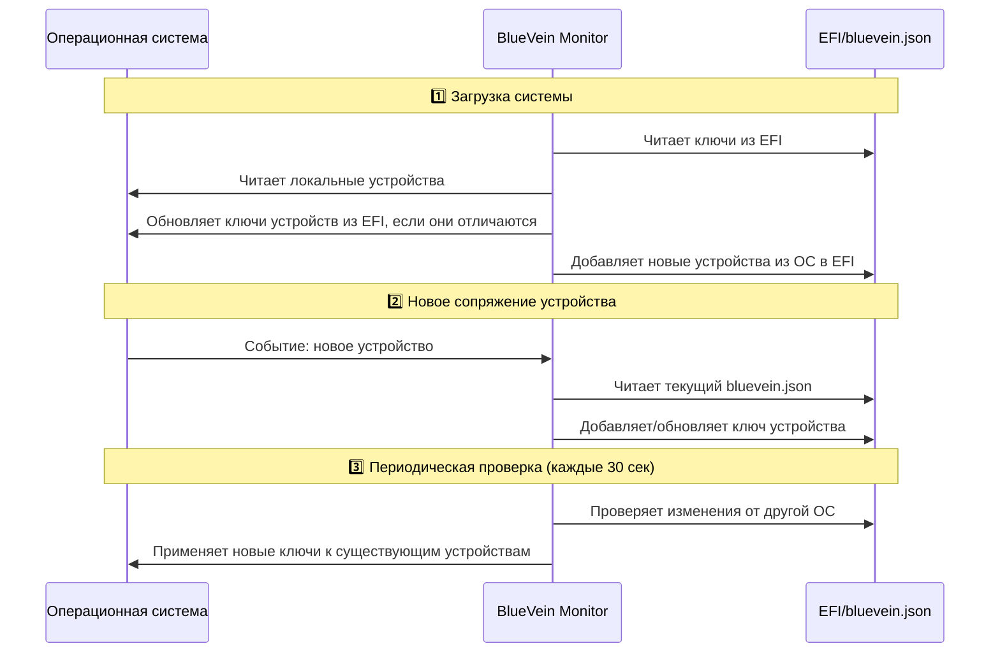

<div align="center">


# 🩸 BlueVein

### *Забудьте о повторном сопряжении Bluetooth-устройств*
**Dual-boot без головной боли**

<br>

[](https://github.com/meowrch/BlueVein/issues)
[](https://github.com/meowrch/BlueVein/stargazers)
[](./LICENSE)


[](./README.ru.md)
[](./README.md)

[🚀 Быстрый старт](#quick-start) -  [⚡ Как работает](#how-it-works) - [🔬 Технические детали](#technical-details) -  [💬 Поддержка](#support)

</div>

***

## 🎯 Проблема, которую мы решили

### **Знакомая ситуация?**

<table> 
  <tr> 
  <td>
  
🎧 **Вы в Windows** 

Подключили Bluetooth-наушники → Работают отлично!

</td> 
  </tr> 
  <tr> 
  <td>

🔄 **Перезагрузка в Linux**

Наушники не работают → Нужно **заново сопрягать**

</td> 
  </tr>
  <tr> 
  <td>

🔁 **Вернулись в Windows**

Наушники снова не работают → **Опять сопрягать**

</td> 
  </tr>
</table>

> [!CAUTION]
> **Этот ад повторяется КАЖДЫЙ раз** при переключении между ОС. \
> С наушниками. С мышью. С клавиатурой. С геймпадом. Со всеми устройствами.

> [!NOTE]
> Интересный факт. На перенастройку bluetooth устройств при переключении между OC ты обычно тратишь от 1-ой до 3-х минут. \
> **3 минуты × 3 переключения в день × 250 рабочих дней = 37,5 часа в год.**


### **BlueVein — это решение:**

Сопрягаете устройство **один раз** в любой ОС. \
Переключаетесь между Windows и Linux. \
**Всё работает автоматически**. Навсегда.

## 🌟 Почему BlueVein?

<div align="center">

| Особенность | Что это дает вам |
|:---:|:---|
| 🔄 **Двусторонняя работа** | Изменения в любой ОС мгновенно синхронизируются |
| 🚀 **Нулевая настройка** | Установили → Запустили → Забыли о проблеме |
| 💾 **Прямой доступ к EFI** | Без монтирования разделов через [fat32-raw](https://github.com/meowrch/fat32-raw) |
| 🛡️ **Безопасность** | Работает на системном уровне с правами администратора |
| 📡 **Реал-тайм мониторинг** | Отслеживает изменения моментально |
| 🔍 **Периодическая проверка** | Каждые 30 секунд проверяет обновления от другой ОС |

</div>

## <a name="quick-start"></a>🚀 Как начать пользоваться?

### Linux

#### Вариант 1: Arch Linux (AUR)

```bash
# Установка через AUR
yay -S bluevein-bin

# Запуск сервиса
sudo systemctl enable --now bluevein

# Проверка статуса
sudo systemctl status bluevein
```

#### Вариант 2: Ручная сборка (любой дистрибутив)

```bash
# 1. Клонируем и собираем
git clone https://github.com/meowrch/BlueVein.git
cd BlueVein
cargo build --release

# 2. Устанавливаем
sudo cp target/release/bluevein /usr/local/bin/
sudo cp ./systemd/bluevein.service /etc/systemd/system/

# 3. Запускаем
sudo systemctl daemon-reload
sudo systemctl enable --now bluevein

# 4. Проверяем
sudo systemctl status bluevein
```

### Windows

#### Вариант 1: Готовый релиз

1. Перейдите в [Releases](https://github.com/meowrch/BlueVein/releases)
2. Скачайте `bluevein.exe` из последнего релиза
3. Откройте PowerShell от Администратора
4. Выполните:

```powershell
# Установка и запуск
.\bluevein.exe install
.\bluevein.exe start

# Проверка
Get-Service BlueVeinService
```

#### Вариант 2: Ручная сборка

```powershell
# 1. Собираем
cargo build --release
cd target\release

# 2. Открываем PowerShell от Администратора

# 3. Устанавливаем и запускаем
.\bluevein.exe install
.\bluevein.exe start

# 4. Проверяем
Get-Service BlueVeinService
```

## ⌨️ Управление сервисом

### Linux

```bash
# Запуск/остановка/перезапуск
sudo systemctl start bluevein
sudo systemctl stop bluevein
sudo systemctl restart bluevein

# Статус и логи
sudo systemctl status bluevein
sudo journalctl -u bluevein -f

# Автозапуск
sudo systemctl enable bluevein   # включить
sudo systemctl disable bluevein  # выключить
```

### Windows

```powershell
# Управление сервисом
.\bluevein.exe start      # Запустить
.\bluevein.exe stop       # Остановить
.\bluevein.exe install    # Установить
.\bluevein.exe uninstall  # Удалить

# Или через net
net start BlueVeinService
net stop BlueVeinService

# Проверка статуса
Get-Service BlueVeinService
```

## <a name="how-it-works"></a>🔥 Как это работает?

### Архитектура системы



### Алгоритм синхронизации




### Ключевые принципы работы

- **При загрузке:** BlueVein проверяет ключи в EFI и обновляет их для устройств, которые есть в системе. Новые устройства из системы добавляются в EFI
- **При новом сопряжении:** Ключ моментально сохраняется в EFI и доступен для другой ОС
- **При удалении:** Устройство остаётся в EFI (оно может быть активно на другой ОС)
- **Периодически:** Проверяет изменения каждые 30 секунд и применяет обновления ключей из EFI

## <a name="technical-details"></a>🔬 Технические детали

### Поддержка Bluetooth LE

BlueVein полностью поддерживает устройства Bluetooth Low Energy со всеми типами ключей:

| Тип ключа | Назначение | Поддержка |
|----------|---------|-------|
| **LTK** | Долгосрочный ключ — основной ключ шифрования | ✅ Полная |
| **Периферийный LTK** | LTK для устройства в роли периферийного устройства | ✅ Полная |
| **IRK** | Ключ разрешения идентичности — для конфиденциальности (случайный MAC) | ✅ Полная |
| **CSRK** | Ключ разрешения подписи соединения — для подписи данных | ✅ Полная |
| **AddressType** | Тип адреса (публичный/случайный) | ✅ Полная |

### Решения по архитектуре

**Устройства с двумя режимами:**
BlueVein автоматически объединяет классические и LE-ключи для устройств, поддерживающих оба режима (например, многие Bluetooth-наушники).

**CSRK SignCounter:**
- Windows не сохраняет SignCounter в реестре — он хранится только в памяти драйвера.
- BlueVein хранит счетчик в `bluevein.json` и берет MAX значение во время синхронизации.
- Это предотвращает откат счетчика и защищает от атак повторного воспроизведения.

### Известные ограничения

**CSRK SignCounter в Windows:**
Стек Bluetooth Windows не сохраняет SignCounter в реестре. BlueVein обходит эту проблему, сохраняя его в `bluevein.json`, но частое переключение ОС может снизить точность.

**Влияние:** минимальное. Современные устройства LE (клавиатуры, мыши, наушники, геймпады) используют LTK для зашифрованных соединений, а не CSRK для подписи данных. Проблема может затронуть только определенные устройства IoT, использующие незашифрованные соединения с подписью.

**Решение:** если устройство не подключается автоматически после синхронизации, повторите сопряжение один раз. Счетчик сбросится, и все будет работать.

## 📚 FAQ

### Это не сломает мой Bluetooth?
Нет. BlueVein только читает и записывает ключи сопряжения. Он не трогает драйверы и системные файлы.

### Какие устройства поддерживаются?
**Любые Bluetooth-устройства**: наушники (AirPods, Sony, Bose), мыши (Logitech MX Master), клавиатуры, геймпады (Xbox, PS5).

**Протестировано на:**
- AirPods Pro 2
- Sony WH-1000XM5
- Logitech MX Master 3
- Xbox Series X Controller

### Мои данные в безопасности?
Да. Ключи сопряжения хранятся в EFI-разделе, доступ к которому есть только у root/admin. BlueVein работает с повышенными привилегиями, но [код открыт](https://github.com/meowrch/BlueVein) — можешь проверить сам.

### А если у меня BitLocker или LUKS-шифрование?
BlueVein работает независимо от шифрования дисков. EFI-раздел обычно не зашифрован и доступен до загрузки ОС.

### Работает ли с triple-boot?
Да. BlueVein синхронизирует ключи между **всеми** ОС на одной машине, не зависимо от количества.

### А если у меня уже стоит `bt-dualboot`?
BlueVein **полностью автоматический** и работает в реальном времени как фоновый сервис.

`bt-dualboot`, мало того, что требует ручных команд после каждого сопряжения, так и имеет несколько других недостатков, выявленных сообществом:
- **Падает на реальных устройствах.** Не поддерживает LE-клавиатуры. Крашится на некоторых конфигах.
- **Не работает с несколькими Bluetooth-адаптерами.** Если у тебя встроенный + внешний адаптер — получишь ошибку.
- **Требует** монтирования windows раздела.
- **Использует [хакерские методы](https://www.kali.org/tools/chntpw/)** изменения системного реестра Windows
- **Заброшен с 2022 года** — issues висят без ответов

---

## ⚒️ Решение проблем

| Проблема | Решение |
|---------|----------|
| ❌ **Сервис не запускается (Linux)** | Выполни `sudo systemctl status bluevein` и проверь логи: `sudo journalctl -u bluevein -n 50` |
| ❌ **Сервис не запускается (Windows)** | Убедись, что PowerShell запущен **от имени Администратора** |
| ❌ **Устройство всё равно не синхронизируется** | Проверь, что EFI-раздел смонтирован: `lsblk -f \| grep vfat` (Linux) или убедись, что сервис запущен |
| ❌ **Permission denied** | BlueVein требует root/admin. На Linux используй `sudo systemctl` или запускай сервис от root |

> [!TIP]
> **Всё ещё не работает?** \
> [Открой issue](https://github.com/meowrch/BlueVein/issues) с логами и информацией об ОС.

## <a name="support"></a>💬 Поддержка

### 🐛 Нашли баг?

1. Соберите логи:
   ```bash
   # Linux
   sudo journalctl -u bluevein -n 100 > bluevein_logs.txt
   
   # Windows
   C:/ProgramData/BlueVein/bluevein.log
   ```

2. [Создайте Issue](https://github.com/meowrch/BlueVein/issues) с подробным описанием и логами

### 💡 Есть идея?

Открывайте [Feature Request](https://github.com/meowrch/BlueVein/issues/new) — мы всегда рады улучшениям!

## 🤝 Contributing

Хотите улучшить BlueVein? Мы будем рады вашему вкладу!

1. Fork репозитория
2. Создайте feature-ветку (`git checkout -b feature/AmazingFeature`)
3. Commit изменений (`git commit -m 'Add some AmazingFeature'`)
4. Push в ветку (`git push origin feature/AmazingFeature`)
5. Откройте Pull Request

## ☕ Поддержать проект

<div align="center">

**Нравится BlueVein?** Помогите развитию проекта! 🚀

| 💎 Криптовалюта | 📬 Адрес |
|:---:|:---|
| **TON** | `UQB9qNTcAazAbFoeobeDPMML9MG73DUCAFTpVanQnLk3BHg3` |
| **Ethereum** | `0x56e8bf8Ec07b6F2d6aEdA7Bd8814DB5A72164b13` |
| **Bitcoin** | `bc1qt5urnw7esunf0v7e9az0jhatxrdd0smem98gdn` |
| **Tron** | `TBTZ5RRMfGQQ8Vpf8i5N8DZhNxSum2rzAs` |

<br>

*Каждый донат мотивирует продолжать развивать проект! ❤️*

</div>

## 📊 Статистика проекта

<a href="https://star-history.com/#meowrch/BlueVein&Date">
<picture>
<source media="(prefers-color-scheme: dark)" srcset="https://api.star-history.com/svg?repos=meowrch/BlueVein&type=Date&theme=dark" />
<source media="(prefers-color-scheme: light)" srcset="https://api.star-history.com/svg?repos=meowrch/BlueVein&type=Date" />

</picture>
</a>

---

<div align="center">

**Сделано с ❤️ для Linux сообщества**

</div>